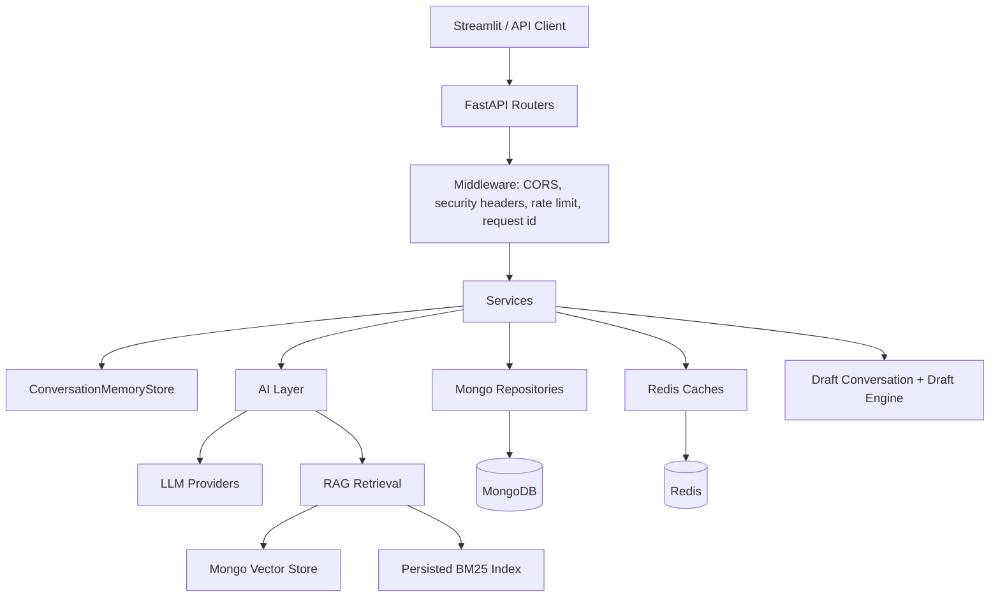
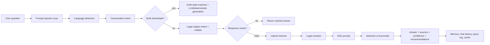
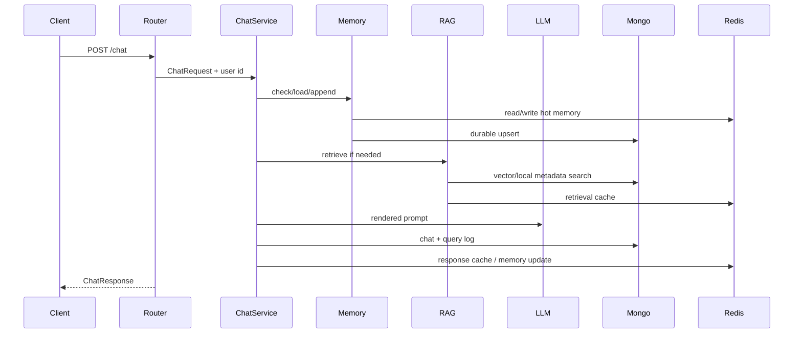
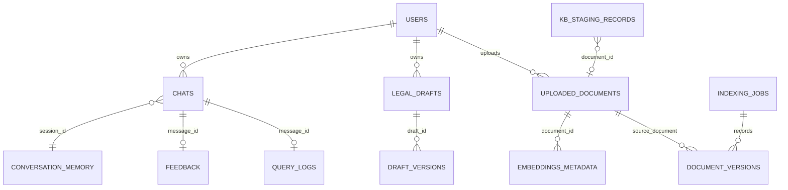
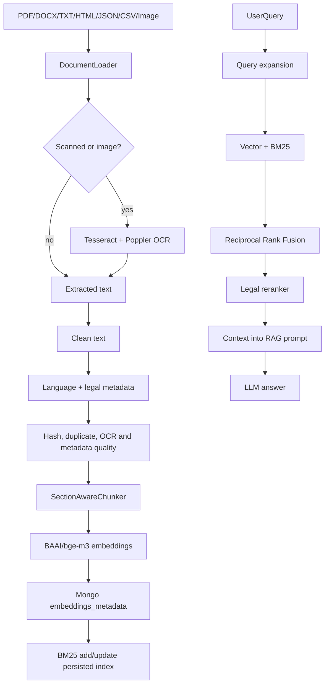
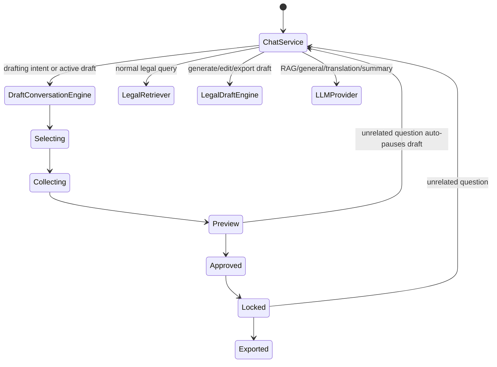
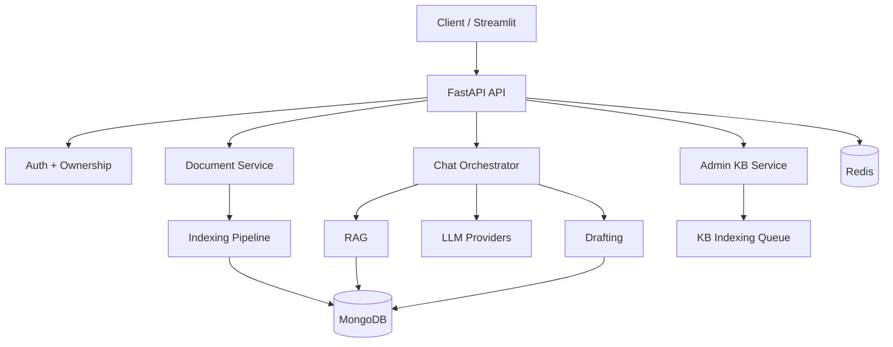
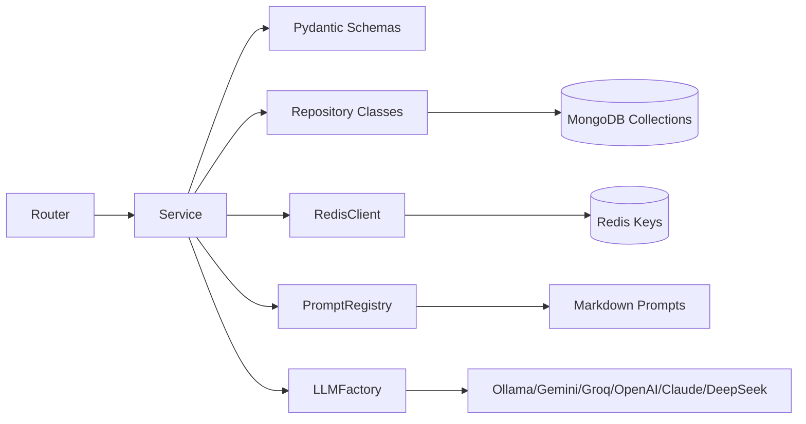
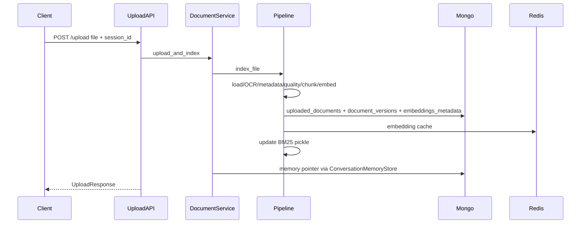

# Legal AI Assistant Architecture Report

Generated from the current repository state. Project-owned source, configuration, tests, scripts, docs, prompts, templates, Docker files, storage layout, and environment configuration were reviewed. Generated/dependency artifacts such as `.venv/`, `.git/`, `__pycache__/`, `.pytest_cache/`, `*.egg-info/`, Mongo backup dumps, and persisted pickle indexes are included as artifacts but are not treated as handwritten architecture modules.

## 1. Project Overview

- **Project name:** `legal-ai-assistant`
- **Objective:** Enterprise-oriented multilingual Indian legal assistant backend with RAG, document ingestion, document analysis, lawyer recommendation, conversational legal drafting, MongoDB persistence, Redis-backed cache/memory, and a Streamlit testing console.
- **Core functionality:** User authentication, legal chat, streaming chat, document upload/indexing, hybrid legal retrieval, document analysis, legal intent/entity detection, lawyer recommendation, feedback/history, admin knowledge-base ingestion/reindexing, analytics, and lifecycle-controlled legal draft generation/export.
- **Primary use cases:** Ask Indian legal questions, retrieve statute/document-backed answers, upload private documents for session/user-scoped analysis, promote admin documents into the shared knowledge base, draft legal notices/complaints/affidavits/applications/contracts through chat, translate/summarize/modify prior answers, and inspect usage/knowledge gaps.

## 2. Directory Structure Analysis

```text
C:\Law Chatbot
|-- .claude/                         Local Claude settings artifact
|-- import.log                       Import/run log artifact
|-- structure.txt                    Large generated structure dump
|-- storage/                         Top-level persisted BM25/staging artifact
`-- legal_ai_assistant/
    |-- app/                         FastAPI application package
    |   |-- api/                     Routers and endpoint definitions
    |   |-- cache/                   Redis client, semantic cache, response cache
    |   |-- core/                    Config, constants, logging, middleware, security, exceptions
    |   |-- database/                MongoDB async client lifecycle
    |   |-- drafting/                Conversational legal drafting engine and templates
    |   |-- entity_extraction/       Rule-based entity extraction/linking
    |   |-- intent/                  Subject and conversation intent detection
    |   |-- language/                Language detection/normalization/explanation depth
    |   |-- llm/                     Provider abstraction, concrete providers, prompt registry
    |   |-- memory/                  Redis + Mongo conversation memory and entity memory
    |   |-- mlops/                   Runtime version registry for cache/index provenance
    |   |-- models/                  Mongo collection names
    |   |-- observability/           In-process metrics/timing store
    |   |-- rag/                     Loading, OCR, metadata, chunking, embeddings, retrieval
    |   |-- recommendation/          Lawyer category recommendation
    |   |-- repositories/            Mongo repository layer
    |   |-- schemas/                 Pydantic request/response models
    |   `-- services/                Business orchestration services
    |-- docker/                      Streamlit Dockerfile and dev compose override
    |-- docs/                        Deployment and LLM provider notes
    |-- scripts/                     Index creation, reindex helpers, test runners
    |-- storage/                     Runtime data: uploads, KB, staging, archive, drafts, backups
    |-- streamlit_app/               Developer chat/testing UI
    |-- tests/                       Pytest coverage for RAG, auth, cache, drafting, routing
    |-- Dockerfile                   API container
    |-- docker-compose.yml           API + Streamlit + Mongo + Redis stack
    |-- pyproject.toml               Python package/dependency/tool config
    |-- .env / .env.example          Runtime settings
    `-- README.md                    User-facing project summary
```

Important file relationships:

- `app/main.py` creates the FastAPI app, connects Mongo/Redis, loads BM25, recovers pending KB jobs, runs upload reconciliation, installs middleware/exception handlers, and includes all routers.
- `app/api/*.py` maps HTTP endpoints to `app/services/*` or `app/drafting/*`.
- `app/services/chat_service.py` is the main runtime orchestrator for chat, memory, intent routing, RAG, LLM calls, caching, analytics, history, recommendation, and drafting handoff.
- `app/rag/pipeline.py` handles ingestion; `app/rag/retriever.py`, `vector_store.py`, `bm25_index.py`, and `reranker.py` handle query-time retrieval.
- `app/llm/*` isolates provider-specific LLM calling from the rest of the application.
- `app/repositories/*` is the persistence boundary over Mongo collections declared in `app/models/collections.py`.
- `app/drafting/templates/*.yaml` are data-only draft definitions; Python engines load them dynamically.
- `streamlit_app/app.py` is a developer console that calls the API, uploads files, renders chat, debug panels, and draft downloads.

## 3. Technology Stack

- **Frontend:** Streamlit, `httpx` client, Streamlit chat/file upload/PDF preview widgets.
- **Backend:** Python 3.12, FastAPI, Uvicorn, Pydantic v2, ORJSON responses, structlog.
- **Database:** MongoDB via Motor async client.
- **AI/ML:** LLM provider abstraction for Ollama, Gemini, Groq, OpenAI, Claude, DeepSeek; sentence-transformers embeddings; Tesseract OCR; PDF/image/document parsing.
- **Vector database:** MongoDB `embeddings_metadata` collection with Atlas `$vectorSearch` support and local cosine fallback.
- **Authentication:** JWT access/refresh tokens with `python-jose`, bcrypt via Passlib, roles (`user`, `lawyer`, `admin`, `super_admin`).
- **Cache:** Redis for rate limit counters, memory hot cache, embedding cache, retrieval cache, semantic response cache stats/generation.
- **Background jobs:** FastAPI `BackgroundTasks`; in-process async queue for admin KB indexing; startup recovery for stuck pending/processing KB jobs.
- **DevOps:** Docker, Docker Compose, pyproject-managed package, pytest, ruff, mypy.
- **Deployment:** API container, Streamlit internal console container, MongoDB 7, Redis 7 Alpine; documented requirement to run `scripts/create_indexes.py`.

## 4. System Architecture

Layers:

- **Client layer:** Streamlit developer UI or any HTTP client.
- **API layer:** FastAPI routers in `app/api`.
- **Service layer:** `ChatService`, `DocumentService`, `AuthService`, `SearchService`, `AnalyticsService`, `KnowledgeBaseIngestionService`, draft engines.
- **Data layer:** Mongo repositories plus Redis cache/memory.
- **AI layer:** LLM providers, prompt registry, embeddings, OCR, RAG retriever/reranker, intent/language/entity modules.



## 5. AI Architecture

- **LLM provider:** Configured by `LLM_PROVIDER`; supports Ollama, Gemini, Groq, OpenAI, Claude, DeepSeek.
- **Embedding model:** `BAAI/bge-m3` by default through sentence-transformers, dimension configured as `1024`.
- **RAG pipeline:** Document load/OCR -> clean -> language detection -> metadata extraction -> quality checks -> legal-boundary chunking -> embedding -> Mongo vector upsert -> BM25 sync -> hybrid retrieval -> RRF -> legal reranking -> prompt-rendered LLM answer.
- **Prompt engineering:** Prompt templates live in `app/llm/prompts/*.md` including system, RAG, general legal knowledge, drafting, translation, summarization, response modification, entity extraction, document analysis, jurisdiction, out-of-domain, related questions, and memory prompts.
- **Agent architecture:** No multi-agent framework is present. The project uses deterministic service/engine orchestration. `ChatService` behaves as a routing agent; `DraftConversationEngine` is a state-machine agent for draft collection/editing/lifecycle.
- **Memory:** `ConversationMemoryStore` writes to Redis and Mongo. It stores summary, recent messages, language preference, current intent/category, uploaded document pointer, failed request state, entity facts, owner identity, and draft state.
- **Vector search:** MongoDB Atlas `$vectorSearch` if available; otherwise local cosine scan over `embeddings_metadata`. BM25 lexical search is a separate persisted in-memory index.
- **Document processing:** PDF, DOCX, text/Markdown, HTML, JSON, CSV, and image inputs; scanned PDFs/images route through Tesseract/Poppler OCR.



## 6. Backend Analysis

API routes:

- **Auth:** `POST /register`, `POST /login`, `POST /logout`.
- **Chat:** `POST /chat`, `POST /chat/stream`, `DELETE /chat`.
- **Documents:** `POST /upload`, `POST /document-analysis`.
- **Search/AI utilities:** `POST /search`, `POST /summarize`, `POST /intent`, `POST /entities`, `POST /recommend-lawyer`.
- **History/session:** `GET /history`, `GET /session`, `DELETE /session`.
- **Feedback:** `POST /feedback`.
- **Health/analytics:** `GET /health`, `GET /dashboard`, `GET /cache`.
- **Admin:** `GET /admin/knowledge-base/status`, `GET /admin/logs/status`, `POST /admin/reindex`, `GET /admin/reindex/{job_id}`, `POST /admin/cache/flush`, `POST /admin/knowledge-base/upload`, `POST /admin/knowledge-base/backfill-uploads`, `GET /admin/knowledge-base/dashboard`, `GET /admin/knowledge-base/staging`.
- **Drafting:** `GET /draft-templates`, `GET /draft-templates/{draft_id}`, `POST /draft`, `POST /draft/edit`, `POST /draft/export`, `POST /draft/approve`, `POST /draft/lock`, `POST /draft/unlock`, `POST /draft/rollback`, `GET /draft/{draft_id}/versions`, `POST /draft/translate`, `POST /legal-terms`, `POST /draft-history`.

Controllers are implemented as FastAPI routers. Services contain most business logic. Middleware provides request IDs/latency headers, security headers, Redis-backed per-IP rate limiting, and CORS. Exceptions use typed `AppError` subclasses mapped to structured JSON payloads.



## 7. Database Analysis

Database type: MongoDB.

Collections:

- `users`: email, full name, password hash, role, active flag.
- `chats`: chat turns by session/user/conversation.
- `sessions`: TTL-bound session records.
- `conversation_memory`: durable memory summary/recent messages/preferences/draft state.
- `uploaded_documents`: uploaded/indexed document records.
- `embeddings_metadata`: chunks, embeddings, text, metadata, namespace.
- `lawyer_categories`, `lawyer_recommendations`: recommendation domain data.
- `prompt_logs`, `query_logs`, `feedback`, `system_logs`, `observability_events`: analytics/logging/feedback.
- `document_versions`, `indexing_jobs`, `kb_staging_records`: KB/document versioning and ingestion state.
- `model_registry`: runtime model/version metadata.
- `semantic_cache`: declared collection, though Redis handles active semantic caches.
- `legal_drafts`, `draft_versions`: generated drafts and version history.

Indexes from `scripts/create_indexes.py` include unique user email; chat session/user timelines; document filename/hash; embedding metadata document/filter/text indexes; document version source/hash/status; indexing job status timeline; feedback session/user; draft session/user/type; draft version lookup; TTL indexes for sessions, conversation memory, and logs; Atlas vector search definition over `embedding` with metadata filters.



## 8. Authentication and Authorization

Registration creates a user document with lowercase email, hashed password, selected role, and `is_active=true`, then returns access and refresh tokens. Login verifies password and active status. Tokens contain `sub`, `role`, `type`, and `exp`.

Authorization is partial:

- `get_current_user_id` extracts optional Bearer access tokens.
- Some routes allow anonymous use; invalid Bearer tokens raise 401.
- Conversation memory enforces session ownership once a session is claimed by an authenticated user.
- Uploaded document access supports global, owner-session, and owner-user visibility.
- Role-based authorization is defined as a `Role` enum but not consistently enforced on admin routes. Admin endpoints currently appear callable without a role guard.
- Logout is stateless and does not revoke refresh tokens.

## 9. RAG Pipeline Analysis

- **Data ingestion:** `/upload` for private documents and `/admin/knowledge-base/upload` or `/admin/reindex` for shared KB.
- **Chunking:** `SectionAwareChunker` splits on section/article/rule/chapter legal boundaries, bare numbered Indian statute headings, or paragraphs, with 2400 character max and 250 character overlap.
- **Embedding generation:** `EmbeddingProvider` batches sentence-transformers encoding, caches per text/model/version in Redis, and uses `asyncio.to_thread`.
- **Vector storage:** Chunks are stored in Mongo `embeddings_metadata`; Atlas vector index is provisioned where supported.
- **Retrieval:** Query expansion/rewriting, embeddings, vector leg, BM25 leg, RRF merge.
- **Re-ranking:** `LegalReranker` blends fused score, lexical overlap, legal metadata bonus, source-type bonus, domain bonus, topic-specific bonuses, section provenance, and TOC penalties.
- **Context generation:** Ranked chunks become source citations and RAG prompt context for the selected LLM.
- **Re-ranking beyond heuristics:** No neural cross-encoder reranker is present.



## 10. Agent Workflow

The project does not implement autonomous multi-agent collaboration or inter-agent communication. It uses deterministic workflows:

- **Chat routing agent:** `ChatService` classifies the request and chooses drafting, translation, memory recall, summarization, lawyer recommendation, out-of-domain, general knowledge, or RAG.
- **Drafting agent:** `DraftConversationEngine` owns selecting -> collecting -> preview -> approved -> locked/exported states.
- **Draft generator:** `LegalDraftEngine` invokes LLM generation with deterministic fallback and versioned persistence.
- **Retrieval agent:** `LegalRetriever` expands queries and coordinates hybrid search.
- **Admin ingestion worker:** `KnowledgeBaseIndexingQueue` serially processes staged KB uploads.



## 11. External Integrations

- **MongoDB:** Primary persistence and vector store.
- **Redis:** Cache, rate limit, session memory hot tier, embeddings cache.
- **LLM APIs:** Gemini, Groq, OpenAI, Claude, DeepSeek, plus local Ollama.
- **OCR/system tools:** Tesseract OCR and Poppler.
- **Document libraries:** `pypdf`, `python-docx`, `BeautifulSoup`, `Pillow`, `pdf2image`, `WeasyPrint`.
- **Not present:** PostgreSQL, Elasticsearch, Kafka/RabbitMQ/Celery, external auth providers, payment systems, or dedicated vector DB like Pinecone/Chroma/Qdrant.

## 12. Docker and Deployment

`docker-compose.yml` runs:

- `api`: builds `Dockerfile`, exposes `8000`, loads `.env`, mounts `./storage`.
- `streamlit`: builds `docker/Dockerfile.streamlit`, exposes `8501`, points to `http://api:8000`.
- `mongo`: MongoDB 7 with persisted volume.
- `redis`: Redis 7 Alpine with AOF persistence.

`Dockerfile` installs Python 3.12 slim, build tools, Tesseract, Poppler, Noto fonts, project dependencies, and runs Uvicorn. `docker/docker-compose.dev.yml` adds reload and source mounts.

Deployment workflow:

1. Provision MongoDB and Redis.
2. Configure secrets/env vars.
3. Build/deploy API container.
4. Run `python scripts/create_indexes.py`.
5. Deploy Streamlit only for internal testing.
6. Configure HTTPS ingress and `/health` checks.
7. Forward logs and monitor analytics/metrics.

No CI/CD workflow files were found.

## 13. Security Analysis

Findings:

- `.env` is present in the repo working directory and contains a non-empty Gemini API key. Rotate it and ensure `.env` is never committed or shared.
- `JWT_SECRET_KEY` is still the default `change-this-secret-in-production` in `.env`, which makes JWTs forgeable if deployed this way.
- Admin routes under `/admin/*` do not show an authentication/role dependency despite role support existing.
- CORS defaults are local-only in examples, but production must restrict origins explicitly.
- Upload extension and size validation exist, but antivirus/malware scanning is not implemented.
- Prompt-injection scanning exists for chat and drafting inputs.
- Session/user ownership checks exist for chat memory and uploaded document access.
- Refresh token rotation/revocation is not implemented; logout is only an acknowledgment.
- Rate limiting is per client IP and Redis-backed; behind proxies it may need trusted-forwarded-IP handling.

## 14. Performance Analysis

Potential bottlenecks:

- Local vector fallback scans up to 20,000 Mongo chunks per query; production should use Atlas `$vectorSearch`.
- BM25 index is rebuilt/persisted with pickle and loaded in process; multi-instance deployments need a strategy for synchronization and cache warming.
- Embedding model loading and inference are heavy; first request/index can be slow.
- ChatService constructs many collaborators per request, though heavy embedding model is class-cached.
- Related-question LLM call adds latency but has a timeout.
- In-process admin KB queue is simple but not durable across processes except for staging recovery; multi-worker deployments can duplicate workers.
- Large uploads are streamed to disk, but processing is synchronous for `/upload` and can block request completion.

Recommendations:

- Use Atlas Vector Search in production.
- Move background jobs to Celery/RQ/Arq or managed queue for multi-instance deployments.
- Add model warmup on startup.
- Add request-level tracing and persistent metrics export.
- Paginate/admin-limit staging and history endpoints.
- Add load tests around `/chat`, `/upload`, and `/admin/reindex`.

## 15. Architecture Diagrams

High-level architecture:



Low-level data flow:



Sequence for document upload:



## 16. Improvement Suggestions

- Add strict auth and role checks to every `/admin/*` route.
- Rotate leaked API keys and replace default JWT secret immediately.
- Keep `.env`, storage backups, pickle indexes, and large generated files out of version control.
- Replace in-process KB queue with a durable job system for production.
- Add refresh-token storage/revocation and logout invalidation.
- Add antivirus/content scanning for uploads.
- Add OpenAPI tags/security metadata and endpoint-level permission tests.
- Move analytics/metrics from in-memory counters to Prometheus/OpenTelemetry.
- Use a real neural reranker if answer precision becomes a priority.
- Add CI for lint, type checking, unit tests, Docker build, and dependency vulnerability scans.
- Clarify whether Streamlit is internal-only; protect it if exposed.
- Add migration/index-management automation to deployment.
- Add structured audit logs for admin ingestion, draft export, and document access.
- Add explicit collection schemas or validation rules for MongoDB.
- Split `ChatService` into smaller workflow handlers as it is currently the highest-complexity module.

